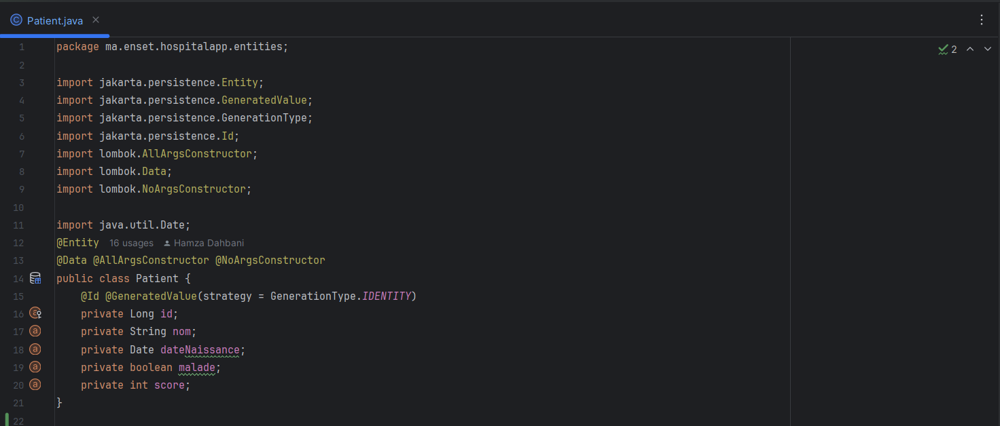
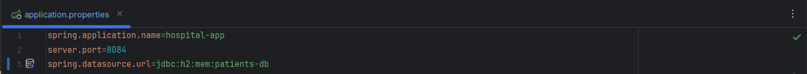
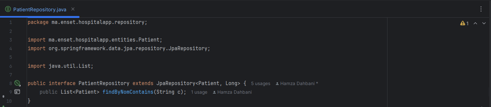
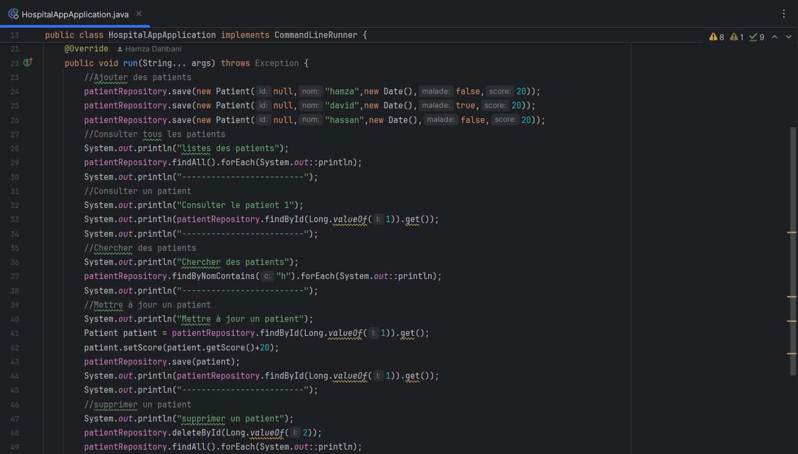
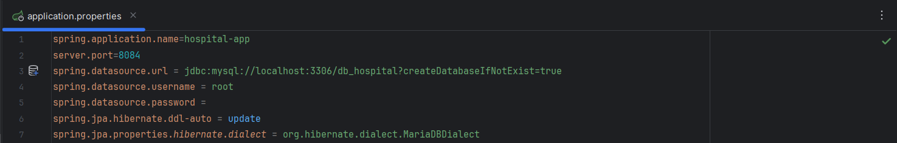
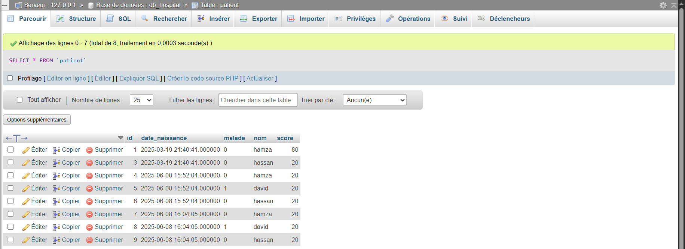
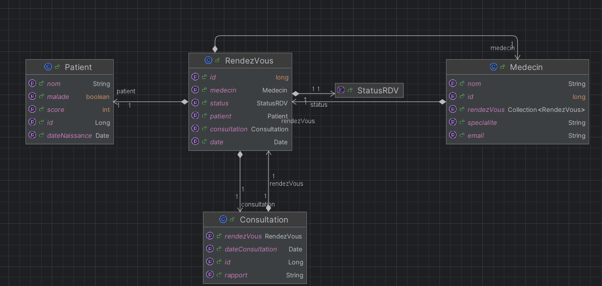
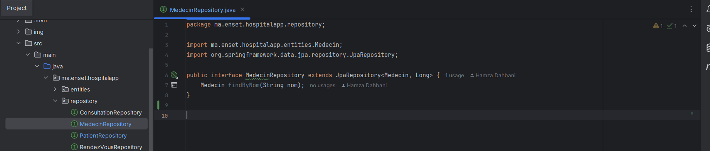
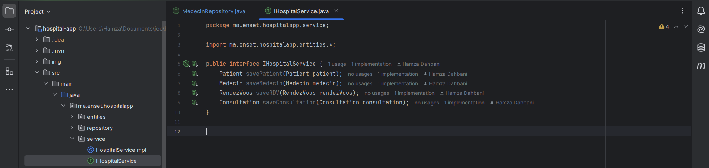
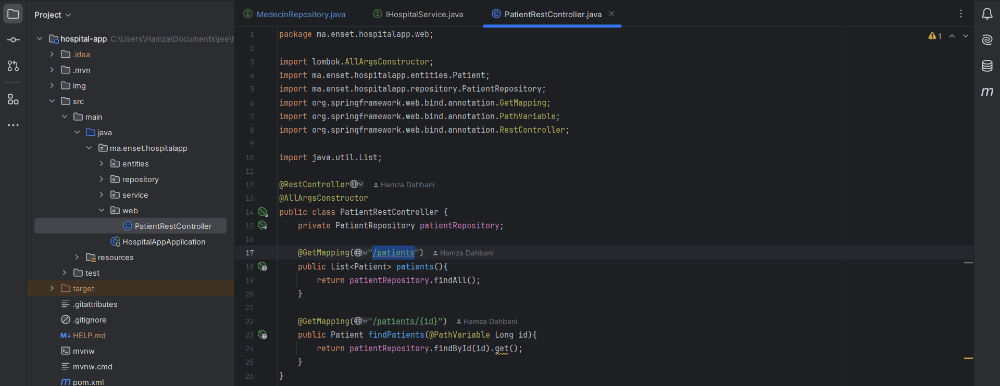

# Activité Pratique N°2 - ORM JPA Hibernate Spring Data

### 1. Créer l'entité JPA Patient ayant les attributs :
       - id de type Long
       - nom de type String
       - dateNaissanec de type Date
       - malade de type boolean
       - score de type int

### 2. Configurer l'unité de persistance dans le ficher application properties

### 3. Créer l'interface JPA Repository basée sur Spring data

### 4. Tester quelques opérations de gestion de patients :

### 5. Migrer de H2 Database vers MySQL

### 6. Reprendre les exemples  du Patient, Médecin, rendez-vous, consultation

